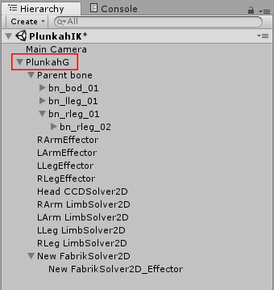
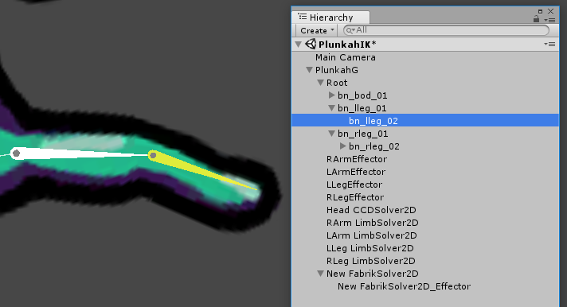
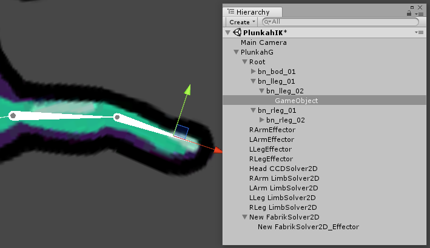
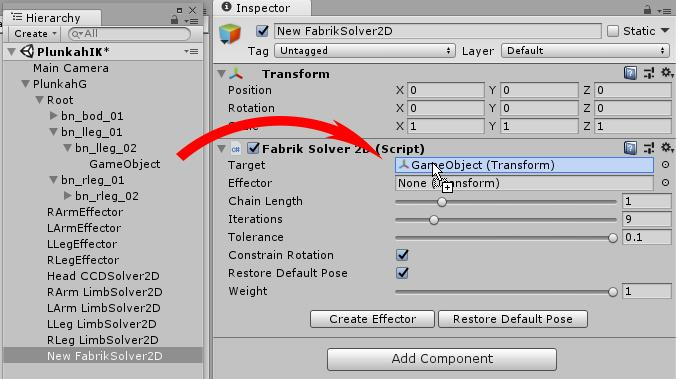
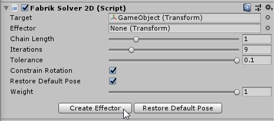
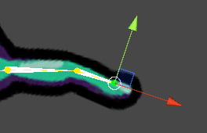
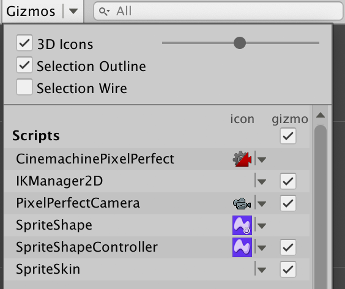
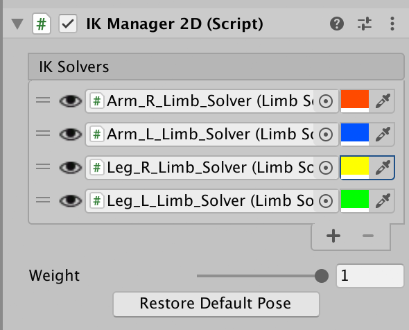

# 2D Inverse Kinematics (IK)

## Overview

The 2D [Inverse Kinematics](https://docs.unity3d.com/Manual/InverseKinematics.html) (IK) package allows you to apply __2D IK__ to the bones and Transforms of your characters’ animation skeletons. __2D IK__ automatically calculates for the positions and rotations of the a chain of bones moving towards a target position. This makes it easier to pose and animate character limbs for animation, or to manipulate a skeleton in real-time, as manually keyframing the chain of bones is not required.  

## Workflow

The following workflow continues from the __2D Animation__ package animation workflow, and demonstrates how to apply __2D IK__ to your character skeletons.

1. Refer to the hierarchy of bones created with the __2D Animation__ package's [Bone tools](https://docs.unity3d.com/Packages/com.unity.2d.animation@4.2/manual/SkinEdToolsShortcuts.html#bone-tools) of the [Skinning Editor](https://docs.unity3d.com/Packages/com.unity.2d.animation@4.2/manual/SkinningEditor.html).

2. Add the [IK Manager 2D](#IKManager) component to the GameObject at the top of the hierarchy. This is usually the main root bone of the entire character skeleton.

3. Add to the [IK Solvers](#IKSolvers) list by selecting which type of __IK Solver__ to use. The IK Solvers are also added as additional GameObjects in the hierarchy.

4. With an __IK Solver__ selected, create and set the __Effector__ and [Target](#target) for the IK Solver.

5. Position bones by moving the __Target's__ position to move the chain of bones with IK applied.

## IK Solvers

The __IK Solver__ calculates the position and rotation the Effector and its connected bones should take to achieve their Target position. Each type of __IK Solver__ has its own algorithm that makes them better suited to different kinds of conditions.

The following are properties are available to all Solvers:

| __Property__                                                 | __Description__                                              |
| ------------------------------------------------------------ | ------------------------------------------------------------ |
| __Effector__                                                 | Define the bone or Transform the IK Solver solves for.       |
| __Target__                                                   | The Transform which is used to indicate the desired position for the Effector. |
| __Constrain Rotation__                                       | This constrains the rotation of the Effector to the rotation of the Target. |
| __Restore Default Pose__                                     | Enable to restore the bones to their original positions before 2D IK is applied. Disable to apply 2D IK in relation to the Effector’s current position and rotation. |
| __Weight__                                                   | Use the slider to adjust the degree the IK Solver’s solution affects the original Transform positions. At the lowest value of 0, the IK solution is ignored. At the maximum value of 1 the IK solution is fully applied. This value is further influenced by the IK Manager's master Weight setting. |
| __The following properties are only available to Chain (CCD) and Chain (FABRIK)__ | -                                                            |
| __Chain Length__                                             | The number of bones/Transforms (starting from the Effector) in the chain that the IK solution is applied to. |
| __Iterations__                                               | The number of times the algorithm runs.                      |
| __Tolerance__                                                | The threshold where the Target is considered to have reached its destination position, and when the IK Solver stops iterating. |

### Limb

This is a standard two bone Solver that is ideal for posing joints such as arms and legs. This Solver’s chain length is fixed to three bones - starting from the Effector bone/Transform and including up to two additional bones in its chain.

### Chain (CCD) - Cyclic Coordinate Descent

This IK Solver uses the *Cyclic Coordinate Descent* algorithm,which gradually becomes more accurate the more times thealgorithm is run. The Solver stops running once the set [tolerance](#tolerance) or [number of iterations](#runs) is reached.

The following property is only available to the __Chain (CCD) IK Solver__:

| __Property__ | __Description__                                              |
| ------------ | ------------------------------------------------------------ |
| __Velocity__ | The speed the IK algorithm is applied to the  Effector until it reaches its destination. |

### Chain (FABRIK) - Forward And Backward Reaching Inverse Kinematics

This __IK Solver__ uses the *Forward And Backward Reaching Inverse Kinematics* (FABRIK) algorithm. It is similar to __Chain (CCD)__ as its solution becomes more accurate the more times its algorithm is run. The Solver stops running once the set [tolerance](#tolerance) or [number of iterations](#runs) is reached.

The __Chain (FABRIK)__ Solver generally takes less iterations to reach the __Target's__ destination compared to __Chain (CCD)__,  but is slower per iteration if rotation limits are applied to the chain. This Solver is able to adapt quickly to if the bones are manipulated in real-time to different positions.

## IK Manager 2D

The __IK Manager 2D__ component controls the __IK Solvers__ in the hierarchy.  Add the Manager component to the highest bone in the hierarchy, commonly referred to as the *Root* bone.

1. In this example, add the component to *PlunkahG* as it is the *Root* bone in the hierarchy:
   

2. To add an IK Solver, click the + symbol at the bottom right of the *IK Solvers* list (see below).
   

3. A drop-down menu then appears with three options - __Chain (CCD)__, __Chain (FABRIK)__, and __Limb__. Each type of [IK Solver](#IKSolvers) uses a different algorithm to solve for the position of Effectors.
   

__IK Solvers__ are iterated in descending order, with Solvers lower in the list referring to the positions set by the Solvers higher in the list. The order of Solvers usually reflects the order of bones/Transforms in the skeleton hierarchy. 

For example, if the arm bone is the child of the torso bone,   then the torso's IK Solver should be set above the arm’s Solver in the list. Rearrange the Solvers by dragging the leftmost edge of a row up or down.

### Weight

Weight measures the degree that a Solver’s solution affects the positions of the bones/Transforms in the chain. The __IK Manager 2D__ has a master Weight property that affects all Solvers it controls. It is applied in addition to the Solver’s individual Weight settings.

### Restore Default Pose

Click this to reset all bones and Transforms back to their original positions.

## Creating an Effector and its Target

After creating an __IK Solver__,  the next step is to set the __Effector__ and its __Target__. A __Target__ is a Transform that represents the target position the Effector attempts to reach. As the Effector moves towards the Target position, the IK Solver calculates for the position and rotation of the Effector and the chain of bones it is connected to.

Follow the steps below to set a __Target__:

1. Select the last bone in the chain.
   

2. Create an empty __Transform__ (right-click > Create Empty). It is automatically created as a child of the highlighted bone.

3. Move the position of the Transform to the tip of the last bone in the chain.
   

4. Select the __IK Solver.__ With its Inspector window open, drag the Transform from the hierarchy onto the __Effector__ field
   

5. Click the __Create Target__ button. A Target is created at the Transform's position.
   

If the __Create Target__ button appears inactive, ensure that the [Chain Length](#ChainL) value is set to one or greater.

6. The Target is created as a child of the IK Solver. It appears as a circle gizmo in the Scene view. Move the __Target__ to manipulate the connected chain of bones.

   

   

## Scene view Gizmo

Toggle or customize the display settings of the IK Gizmos to adjust their visibility when animating your characters. This is useful when you need to improve their readability or to reduce on-screen noise when editing animating your characters.

### Global IK Gizmos Toggle

You can toggle the IK Gizmos by going to the Gizmos drop-down menu at the upper right of the Scene view window, then select or clear __IKManager2D__ (menu: __Gizmos > Recently Changed > IKManager2D__) to enable or disable the Gizmos respectively.

### Solver Gizmos

Customize __Solver Gizmos__ via the __IK Manager 2D__ component that manages the Solvers. From the __IK Manager 2D__ Component Inspector, you can individually hide the Solver's Gizmo to isolate only the Solvers that you are interested in. To futher distinguish the Gizmos, you can also customize the colors of the Gizmos from the __IK Manager 2D__ Component Inspector

## Scripting API Reference

### Adding New Solvers

You can add your own solver by extending from the class __Solver2D__. Your extended class will then show up as a new solver under the solver menu in the __IKManager2D__ component.

#### Solver2D

This is the base class for all IK Solvers in this package. __IKManager2D__ will detect all classes extending this and accept it as a Solver it can control. Implement or override the following methods to create your own IK Solver:

- protected abstract int GetChainCount()

This function returns the number of IK chains the solver owns. Use this to return the number of IK chains your solver owns.

- public abstract IKChain2D GetChain(int index)

This function returns the IKChain2D at the given index. Use this to return the IKChain2D your solver owns at the given index.

- protected virtual bool DoValidate()

This function does validation for all parameters passed into the solver. Use this to check if your solver is set up correctly with all inputs.

- protected virtual void DoInitialize()

This function initializes the solver and builds the IK chains owned by the solver. This is called whenever the solver is invalid after changing the target of the solver or other parameters of the solver. Use this to do initialize all the data from the parameters given to the solver, such as the IK chains owned by the solver.

- protected virtual void DoPrepare()

This function prepares and converts the information of the Transforms (position, rotation, IK parameters etc) to structures which can be used by the IK algorithms. Use this to do any work to gather data used by your solver when updating the IK positions.

- protected abstract void DoUpdateIK(List effectorPositions)

This function calculates and sets the desired IK positions for the Transforms controlled by the solver given a list of effector positions for each chain owned by the solver. The effector positions may be overridden by user positions if manipulated from the SceneView.

- protected virtual Transform GetPlaneRootTransform()

This function returns the transform whose localspace XY plane is used to perform IK calculations. Use this to define the Transform used.

#### IKChain2D

This is the class which stores the transforms involved in an IK chain. When a chain is set up with a target and a transform count, initializing the Solver will populate the chain with the right transforms if valid.

- __Target__ - The transform which is used as the desired position for the target.
- __Effector__ - The transform to perform IK on to reach a desired position. 
- __TransformCount__ - The number of transforms involved in the IK solution starting from the target. This is generally equivalent to ChainLength in solvers.
- __Transforms__ - All transforms involved in the chain. In general, the last transform in this is the target transform and the first transform is considered the root transform for the chain.
- __Lengths__ - The lengths between each transform in the chain.

#### Solver2DMenu

This attribute allows you to tag your Solver2D with a different name under the IKManager2D. Use this if you do not want to use the name of the class of the Solver2D.

Example when giving the LimbSolver2D the name 'Limb' in the menu: `[Solver2DMenuAttribute("Limb")]`
